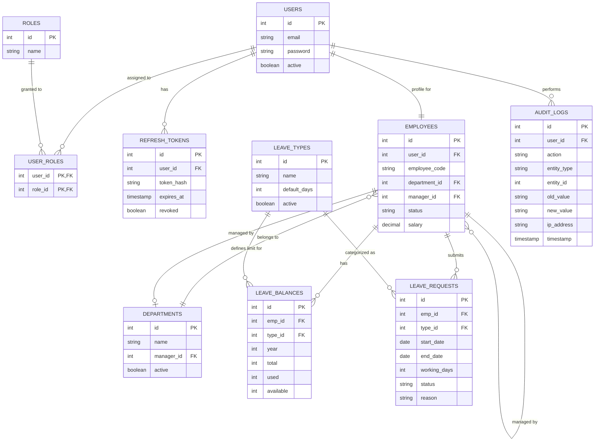

# Leave Management System

This is a complete, enterprise-ready Leave Management System backend built with Java and Spring Boot. It handles core employee logic, leave requests, leave balances, and department structures while explicitly enforcing business rules (overlap detection, weekend exclusion, and balance integrity).

## Tech Stack
- **Java 17+**
- **Spring Boot 3.3+** (Web, Data JPA, Validation)
- **MySQL 9.7.1**
- **Liquibase** (Database Migrations)
- **Maven** (Build Tool)
- **Springdoc OpenAPI** (Swagger API Documentation)

## Setup & Run Instructions

### 1. Database Setup
Start a local MySQL container on port `3306` with the database `leave_management_db`.
Configure the `src/main/resources/application.properties` to point to your database credentials.

### 2. Build & Test
Run the complete automated test suite (58 tests covering all business logic) from the root directory:
```bash
./mvnw clean test
```

### 3. Run Application
Start the Spring Boot server:
```bash
./mvnw spring-boot:run
```
The application will run on `http://localhost:8080`. Liquibase will automatically create all tables and schema constraints on startup.

## API Documentation & Testing

### Swagger UI
Once the application is running, navigate to:
**[http://localhost:8080/swagger-ui.html](http://localhost:8080/swagger-ui.html)** to view the interactive API documentation and test endpoints directly from the browser.

### Postman Collection
A comprehensive End-to-End Postman collection is included in this repository: `LMS_E2E_Workflow.postman_collection.json`. 
You can import this directly into Postman to test the full lifecycle of a leave request.

## Security Boundary & Known Limitations

This project explicitly focuses on core business logic, strict state transitions, and robust exception handling. As per the defined scope of this internship project, the following are intentionally omitted:

- **Authentication & Role-Based Authorization:** No JWT, Spring Security, or session management is implemented. All endpoints are currently open.
- **Identity Context Context:** Because there is no active security context (e.g., `SecurityContextHolder`), the API explicitly accepts `employeeId` directly in the request payloads (e.g., when applying for a leave). In a production environment with authentication, this would be inherently derived from the authenticated user's token rather than trusted from the client payload.

This demonstrates that the lack of authentication is a known and deliberate architectural boundary, allowing focus entirely on domain complexity and edge-case testing.

## Features Implemented
- Complete Employee and Department tracking.
- Leave Type configurations (e.g. Annual, Sick).
- Leave Balance management with automatic deductions/restorations.
- Strict State Machine transitions (`PENDING` -> `APPROVED` / `REJECTED` / `CANCELLED`).
- Intelligent date calculations (automatically skips weekends).
- Bullet-proof exception handling providing consistent HTTP 400/404/409 errors.
## ER Diagrams


